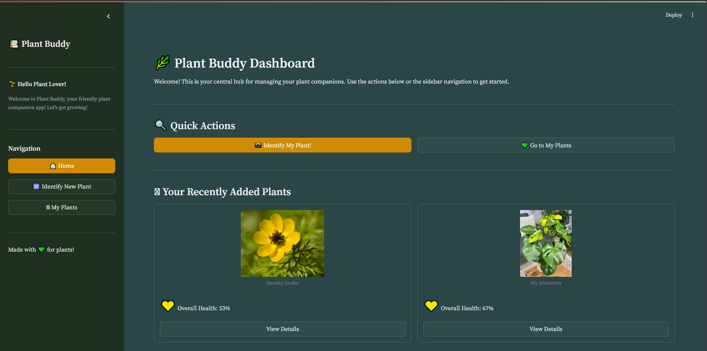

# 🌿 Plant Buddy - Your Green Companion 🌿

[](https://python.org)
[](https://streamlit.io)
<!-- Add other badges if you have them, e.g., build status, code coverage -->

Welcome to Plant Buddy, your all-in-one application for identifying plants, receiving detailed care instructions, chatting with your leafy friends, and monitoring their health!

**https://plant-buddy.streamlit.app/**

---

## ✨ Features

*   📸 **Plant Identification:** Upload an image of a plant and get instant identification (species, common name, confidence) powered by the PlantNet API.
*   📋 **Detailed Care Guides:** Access comprehensive care instructions for identified plants from our database, covering light, water, temperature, humidity, feeding, and more.
*   💬 **Chat with Your Plants:** Engage in unique, AI-powered conversations with your plants! Each plant can have its own "personality" based on its care profile, thanks to Google Gemini.
*   🪴 **My Plants Collection:** Save identified plants to your personal collection with nicknames, images, and their specific care info and chat logs.
*   📊 **Health Stats & Monitoring:**
    *   Track the overall health score of your saved plants.
    *   View historical health trends with charts.
    *   Visualize key metrics like moisture and temperature with dynamic "Apple Watch-style" rings.
    *   (Optional) Connect to a MongoDB database for live sensor data integration (temperature & moisture).
*   🎨 **Intuitive & Themed UI:** A clean, user-friendly interface built with Streamlit, featuring a custom theme for a pleasant visual experience.
*   📱 **PWA Ready:** Includes a `manifest.json` for Progressive Web App capabilities, allowing users to "install" the app on their devices.

---

## 🖼️ Preview



---

## 💡 How It Works

*   **User Interface (UI):** Built with Streamlit, providing interactive widgets and a reactive experience.
*   **Plant Identification:** When an image is uploaded, `plant_net.py` sends it to the PlantNet API. The response is parsed to extract scientific/common names and confidence.
*   **Care Information:** Identified plant names are used to search the local `plants_with_personality3_copy.json` database for detailed care instructions using exact and fuzzy matching.
*   **Plant Chat:** The identified plant's name and (if available) its care profile/personality traits are used to construct a system prompt for the Google Gemini API. `streamlit_app.py` manages the chat history and sends requests to Gemini for conversational responses.
*   **Data Storage (Saved Plants):** User-saved plants (nickname, image, ID result, care info, chat log, health data) are stored in Streamlit's session state (`st.session_state.saved_photos`). This data is persistent for the current session.
*   **Health Stats:**
    *   Simulated moisture/temperature values are stored with saved plants.
    *   Overall health is calculated based on these values and data freshness.
    *   If MongoDB is configured, `streamlit_app.py` can fetch the latest generic sensor readings.
*   **Theming:** A custom theme is defined in `.streamlit/config.toml` and supplemented with inline CSS in `streamlit_app.py` for specific component styling.

---

## 📚 Table of Contents

*   [Features](#-features)
*   [Sneak Peek](#-sneak-peek)
*   [Tech Stack](#-tech-stack)
*   [Prerequisites](#-prerequisites)
*   [Getting Started](#-getting-started)
    *   [Clone the Repository](#1-clone-the-repository)
    *   [Set Up Virtual Environment (Recommended)](#2-set-up-virtual-environment-recommended)
    *   [Install Dependencies](#3-install-dependencies)
    *   [Configure API Keys & MongoDB](#4-configure-api-keys--mongodb)
*   [Running the Application](#-running-the-application)
*   [File Structure](#-file-structure)
*   [How It Works](#-how-it-works)
*   [Contributing](#-contributing)
*   [License](#-license)
*   [Acknowledgements](#-acknowledgements)

---

## 🛠️ Tech Stack

*   **Frontend:** [Streamlit](https://streamlit.io/)
*   **Plant Identification:** [PlantNet API](https://my.plantnet.org/projects/api-doc)
*   **Chat Functionality:** [Google Gemini API (1.5 Flash)](https://ai.google.dev/models/gemini)
*   **Database (Optional Sensor Data):** [MongoDB](https://www.mongodb.com/)
*   **Core Language:** Python 3.9+
*   **Key Python Libraries:**
    *   `requests` (for API calls)
    *   `Pillow (PIL)` (for image processing)
    *   `python-dotenv` (for environment variable management)
    *   `pymongo` (for MongoDB interaction)
    *   `fuzzywuzzy` (for string matching in plant database)
    *   `pandas` (for data handling, e.g., health history charts)

---

## 📋 Prerequisites

Before you begin, ensure you have the following installed:

*   Python (3.9 or higher recommended)
*   pip (Python package installer)
*   Git (for cloning the repository)

---

## 🚀 Getting Started

Follow these steps to get Plant Buddy running on your local machine.

### 1. Clone the Repository

```bash
git clone https://github.com/[YourGitHubUsername]/[YourPlantBuddyRepoName].git
cd [YourPlantBuddyRepoName]
```

### 2. Set Up Virtual Environment (Recommended)

It's good practice to create a virtual environment to manage project dependencies.

```bash
# For Windows
python -m venv venv
.\venv\Scripts\activate

# For macOS/Linux
python3 -m venv venv
source venv/bin/activate
```

### 3. Install Dependencies

Install all the required Python packages using the `requirements.txt` file.
(If `requirements.txt` is not present, you can create one using `pip freeze > requirements.txt` after installing the libraries listed in the Tech Stack, or install them manually.)

```bash
pip install -r requirements.txt
# If no requirements.txt, install manually:
# pip install streamlit requests Pillow python-dotenv pymongo fuzzywuzzy pandas python-Levenshtein
```
*(Note: `python-Levenshtein` can speed up `fuzzywuzzy` and is often a good addition.)*

### 4. Configure API Keys & MongoDB

This application requires API keys for PlantNet and Google Gemini, and optionally a MongoDB URI for sensor data.

1.  **Create a `.env` file** in the root directory of the project:
    ```
    touch .env
    ```

2.  **Add your credentials** to the `.env` file. It should look like this:

    ```env
    PLANTNET_API_KEY="your_plantnet_api_key_here"
    GEMINI_API_KEY="your_google_gemini_api_key_here"
    MONGO_URI="your_mongodb_connection_string_here" # Optional
    ```

    *   **PlantNet API Key:** Obtain from [Pl@ntNet API official website](https://my.plantnet.org/projects/api-doc) (you might need to register).
    *   **Google Gemini API Key:** Obtain from [Google AI Studio](https://aistudio.google.com/app/apikey).
    *   **MongoDB URI (Optional):** If you want to use the MongoDB sensor data feature, provide your connection string. If not, the app will simulate this data or indicate it's unavailable. The app attempts to connect to a database named `temp_moisture` and a collection `c1`.

The `api_config.py` file is set up to load these environment variables.

---

## 🏃 Running the Application

Once the dependencies are installed and the `.env` file is configured, you can run the Streamlit app:

```bash
streamlit run streamlit_app.py
```

The application should open in your default web browser.

---

## 📁 File Structure

Here's a simplified overview of the project structure:

```
plant-buddy/
├── .env                    # API keys and MongoDB URI (created by you)
├── api_config.py           # Loads environment variables
├── manifest.json           # PWA manifest
├── plant_net.py            # PlantNet API interaction class
├── plants_with_personality3_copy.json # Plant care database with personality traits
├── streamlit_app.py        # Main Streamlit application logic
├── example_plant_1.jpg     # Example image for default saved plants
├── example_plant_2.jpg     # Example image for default saved plants
├── requirements.txt        # Python dependencies (you might need to generate this)
├── .streamlit/             # Streamlit configuration (e.g., config.toml for theme)
│   └── config.toml
└── README.md               # This file
```

---

## 🤝 Contributing

Contributions are welcome! If you have ideas for improvements, new features, or bug fixes, please feel free to:

1.  Fork the repository.
2.  Create a new branch (`git checkout -b feature/YourAmazingFeature`).
3.  Make your changes.
4.  Commit your changes (`git commit -m 'Add some YourAmazingFeature'`).
5.  Push to the branch (`git push origin feature/YourAmazingFeature`).
6.  Open a Pull Request.

Please ensure your code follows good practices and includes relevant documentation or comments.

---

## 🙏 Acknowledgements

*   The [Pl@ntNet team](https://plantnet.org/) for their incredible plant identification API.
*   [Google](https://ai.google/) for the Gemini API, enabling the chat feature.
*   The [Streamlit community](https://streamlit.io/community) for the amazing open-source framework.
*   A massive thanks to the team at [CUNY Tech Prep](https://cunytechprep.org/) for teaching us everything we know: [Zack DeSario](https://www.linkedin.com/in/zackd/), [Kevin Li](https://www.linkedin.com/in/likenun/), [Jackie Bellando](https://www.linkedin.com/in/jackiebellando/), [Mauro Gomez](https://www.linkedin.com/in/maurodantegomez/), [Julissa Napoletano](https://www.linkedin.com/in/julissa-napoletano/), [Emily Chiu](https://www.linkedin.com/in/chiuemily/), and so many more!

---

Happy Plant Parenting with Plant Buddy! 🌻
